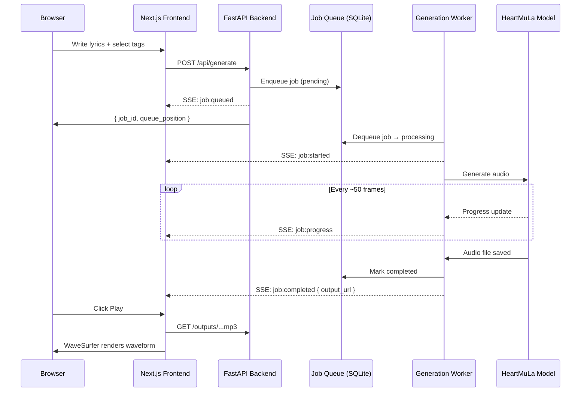
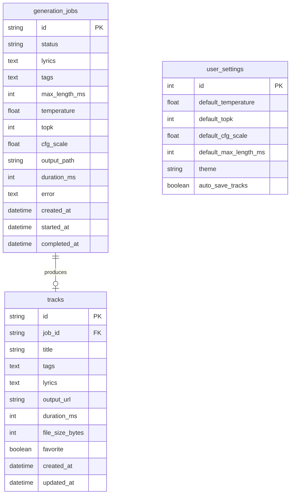

<div align="center">

# HeartMuLa Studio

### AI Music Generation Web UI

[](https://nextjs.org/)
[](https://fastapi.tiangolo.com/)
[](https://react.dev/)
[](https://www.typescriptlang.org/)
[](https://python.org/)
[](LICENSE)

A full-featured **Suno AI-like** web studio for the open-source [HeartMuLa](https://github.com/HeartMuLa/heartlib) music generation model. Generate full songs with vocals from lyrics and style tags — all running locally on your GPU.

[Getting Started](#-getting-started) &bull; [Features](#-features) &bull; [Architecture](#-architecture) &bull; [API Reference](#-api-reference) &bull; [Configuration](#-configuration)

</div>

---

## Features

| Feature | Description |
|---------|------------|
| **Lyrics Editor** | Write lyrics with structure tag insertion (`[Verse]`, `[Chorus]`, `[Bridge]`, etc.) |
| **Style Tag Picker** | Categorized, searchable tags across genre, mood, instruments, vocals, and tempo |
| **Generation Queue** | Submit multiple songs — real-time progress via Server-Sent Events (SSE) |
| **Track Library** | Search, sort, filter, and manage your generated tracks |
| **Waveform Player** | Persistent mini player with WaveSurfer.js waveform visualization |
| **Audio Transcription** | Upload existing audio to extract lyrics via HeartTranscriptor |
| **GPU Monitoring** | Live VRAM usage display and model state indicators |
| **Crash Recovery** | SQLite WAL-mode database — stale jobs auto-recover on restart |
| **Dark Theme** | Full dark mode UI built with shadcn/ui components |

## Screenshots

> *Screenshots coming soon — run `make dev` and see for yourself!*

## Getting Started

### Prerequisites

| Tool | Version | Purpose |
|------|---------|---------|
| [Python](https://python.org/) | 3.10+ | Backend runtime |
| [Node.js](https://nodejs.org/) | 18+ | Frontend runtime |
| [uv](https://docs.astral.sh/uv/) | latest | Python package manager |
| [pnpm](https://pnpm.io/) | 8+ | Node.js package manager |
| NVIDIA GPU | 12GB+ VRAM | Model inference (optional for mock mode) |

### Quick Start

```bash
# Clone the repository
git clone https://github.com/rustyorb/heartmula-studio.git
cd heartmula-studio

# Install dependencies
make setup-backend
make setup-frontend

# Start both servers (backend on :8000, frontend on :3000)
make dev
```

Then open **http://localhost:3000** — you'll land on the Studio page.

> [!NOTE]
> The app runs in **mock mode** by default — no GPU or HeartMuLa model installation required. Mock generation creates silent MP3 files with simulated progress to test the full pipeline.

### Manual Setup

<details>
<summary><strong>Backend only</strong></summary>

```bash
cd backend
uv sync                              # Install Python dependencies
uv run alembic upgrade head          # Run database migrations
uv run uvicorn app.main:app --reload --port 8000
```

</details>

<details>
<summary><strong>Frontend only</strong></summary>

```bash
cd frontend
pnpm install                         # Install Node dependencies
pnpm dev                             # Start dev server on :3000
```

</details>

<details>
<summary><strong>With real HeartMuLa model</strong></summary>

```bash
# Install HeartMuLa (requires PyTorch + CUDA)
pip install heartlib

# The model downloads automatically on first generation (~6GB)
# For GPUs with < 14GB VRAM, mmgp mode is auto-enabled
```

</details>

---

## Architecture

```
heartmula-studio/
├── backend/                    # FastAPI + Python
│   ├── app/
│   │   ├── main.py             # App factory, lifespan, router registration
│   │   ├── config.py           # pydantic-settings configuration
│   │   ├── database.py         # Async SQLite + WAL mode
│   │   ├── dependencies.py     # FastAPI dependency injection
│   │   ├── models/             # SQLAlchemy ORM models
│   │   │   ├── job.py          #   GenerationJob
│   │   │   ├── track.py        #   Track
│   │   │   └── settings.py     #   UserSettings (singleton)
│   │   ├── schemas/            # Pydantic request/response types
│   │   ├── routers/            # API endpoints
│   │   │   ├── generation.py   #   POST /generate, GET/DELETE /jobs
│   │   │   ├── tracks.py       #   CRUD /tracks
│   │   │   ├── transcription.py#   POST /transcribe
│   │   │   ├── events.py       #   GET /events (SSE stream)
│   │   │   ├── system.py       #   GET /health, /gpu
│   │   │   └── settings.py     #   GET/PUT /settings
│   │   ├── services/           # Business logic
│   │   │   ├── pipeline_manager.py    # HeartMuLa model lifecycle
│   │   │   ├── job_queue.py           # SQLite-backed persistent queue
│   │   │   ├── generation_worker.py   # Background generation loop
│   │   │   ├── event_broadcaster.py   # SSE fan-out to clients
│   │   │   ├── gpu_manager.py         # GPU detection + VRAM monitoring
│   │   │   ├── storage_service.py     # File I/O for outputs/uploads
│   │   │   └── transcription_service.py
│   │   └── utils/
│   │       ├── progress_hook.py # tqdm monkey-patch for progress
│   │       └── audio.py         # Duration detection
│   ├── alembic/                # Database migrations
│   ├── data/                   # Runtime: SQLite DB, outputs, uploads
│   └── pyproject.toml
│
├── frontend/                   # Next.js 15 + React 19
│   ├── src/
│   │   ├── app/                # Pages (App Router)
│   │   │   ├── studio/         #   Lyrics editor + queue panel
│   │   │   ├── library/        #   Track grid with filters
│   │   │   ├── transcribe/     #   Audio upload + transcript view
│   │   │   └── settings/       #   Defaults + system info
│   │   ├── components/
│   │   │   ├── layout/         #   Sidebar, Header, AppShell, SSEProvider
│   │   │   ├── studio/         #   LyricsEditor, TagPicker, GenerationParams
│   │   │   ├── queue/          #   JobCard, QueuePanel
│   │   │   ├── library/        #   TrackCard, TrackGrid, TrackFilters
│   │   │   ├── player/         #   MiniPlayer (WaveSurfer.js)
│   │   │   ├── transcription/  #   UploadZone, TranscriptView
│   │   │   ├── shared/         #   GpuStatus, ModelStatus, ProgressBar
│   │   │   └── ui/             #   14 shadcn/ui primitives
│   │   ├── stores/             # Zustand state management
│   │   │   ├── useStudioStore  #   Lyrics, tags, params, submit
│   │   │   ├── useQueueStore   #   Job queue, SSE-driven updates
│   │   │   ├── usePlayerStore  #   Audio playback state
│   │   │   ├── useLibraryStore #   Tracks, search, pagination
│   │   │   ├── useSystemStore  #   Connection, GPU, model state
│   │   │   └── useSettingsStore#   User preferences
│   │   ├── hooks/              #   useSSE, useAudioPlayer, useDebounce
│   │   ├── lib/                #   API client, SSE manager, utils
│   │   └── types/              #   TypeScript interfaces
│   └── package.json
│
└── Makefile                    # dev, setup, migrate commands
```

### Tech Stack

<table>
<tr>
<td width="50%">

**Backend**
- [FastAPI](https://fastapi.tiangolo.com/) — async Python API framework
- [SQLAlchemy](https://www.sqlalchemy.org/) 2.0 — async ORM
- [SQLite](https://sqlite.org/) — WAL mode, zero-config database
- [SSE-Starlette](https://github.com/sysid/sse-starlette) — Server-Sent Events
- [Alembic](https://alembic.sqlalchemy.org/) — database migrations
- [Pydantic](https://docs.pydantic.dev/) v2 — validation & settings
- [uv](https://docs.astral.sh/uv/) — fast Python package manager

</td>
<td width="50%">

**Frontend**
- [Next.js](https://nextjs.org/) 15 — App Router, React Server Components
- [React](https://react.dev/) 19 — UI library
- [TypeScript](https://www.typescriptlang.org/) 5 — type safety
- [Tailwind CSS](https://tailwindcss.com/) 4 — utility-first styling
- [shadcn/ui](https://ui.shadcn.com/) — Radix-based component library
- [Zustand](https://zustand-demo.pmnd.rs/) — lightweight state management
- [WaveSurfer.js](https://wavesurfer.xyz/) 7 — audio waveform visualization

</td>
</tr>
</table>

### Data Flow



---

## API Reference

### Generation

| Method | Endpoint | Description |
|--------|----------|-------------|
| `POST` | `/api/generate` | Submit a generation job |
| `GET` | `/api/jobs` | List all jobs (filterable by `status`) |
| `GET` | `/api/jobs/{id}` | Get job details |
| `DELETE` | `/api/jobs/{id}` | Cancel a pending job |

<details>
<summary><strong>POST /api/generate</strong> — Request body</summary>

```json
{
  "lyrics": "[Verse]\nHello world\n\n[Chorus]\nSing along",
  "tags": "pop, electronic, female vocal",
  "max_length_ms": 240000,
  "temperature": 1.0,
  "topk": 50,
  "cfg_scale": 1.5
}
```

| Field | Type | Default | Range | Description |
|-------|------|---------|-------|-------------|
| `lyrics` | string | *required* | — | Song lyrics with optional `[Section]` markers |
| `tags` | string | *required* | — | Comma-separated style tags |
| `max_length_ms` | int | `240000` | 30,000–360,000 | Maximum audio duration |
| `temperature` | float | `1.0` | 0.1–2.0 | Sampling temperature |
| `topk` | int | `50` | 1–500 | Top-K sampling |
| `cfg_scale` | float | `1.5` | 1.0–10.0 | Classifier-free guidance scale |

</details>

### Tracks

| Method | Endpoint | Description |
|--------|----------|-------------|
| `GET` | `/api/tracks` | List tracks with search, sort, pagination |
| `GET` | `/api/tracks/{id}` | Get track details |
| `PATCH` | `/api/tracks/{id}` | Update title, tags, or favorite |
| `DELETE` | `/api/tracks/{id}` | Delete track and audio file |

### Transcription

| Method | Endpoint | Description |
|--------|----------|-------------|
| `POST` | `/api/transcribe` | Upload audio → extract lyrics (SSE result) |

### System

| Method | Endpoint | Description |
|--------|----------|-------------|
| `GET` | `/api/health` | Health check with model state |
| `GET` | `/api/gpu` | GPU/VRAM status |
| `GET` | `/api/events` | SSE stream (real-time updates) |
| `GET` | `/api/settings` | Get user preferences |
| `PUT` | `/api/settings` | Update user preferences |

### SSE Events

| Event | Payload | Description |
|-------|---------|-------------|
| `system:connected` | `{}` | Initial connection established |
| `model:loading` | `{ progress, message }` | Model loading progress |
| `model:ready` | `{ state }` | Model loaded and ready |
| `gpu:status` | `{ name, vram_total_gb, ... }` | GPU status update |
| `job:queued` | `{ job_id, status, ... }` | New job added to queue |
| `job:started` | `{ job_id }` | Job dequeued, generation starting |
| `job:progress` | `{ job_id, step, total_steps, progress }` | Frame-by-frame progress |
| `job:completed` | `{ job_id, track_id, output_url, duration_ms }` | Generation finished |
| `job:failed` | `{ job_id, error }` | Generation error |
| `job:cancelled` | `{ job_id }` | Job cancelled by user |
| `transcription:completed` | `{ job_id, lyrics }` | Transcription finished |
| `transcription:failed` | `{ job_id, error }` | Transcription error |

---

## Configuration

### Environment Variables

| Variable | Default | Description |
|----------|---------|-------------|
| `HEARTMULA_DATABASE_URL` | `sqlite+aiosqlite:///data/heartmula.db` | Database connection string |
| `HEARTMULA_OUTPUT_DIR` | `data/outputs` | Audio output directory |
| `HEARTMULA_UPLOAD_DIR` | `data/uploads` | Upload temp directory |
| `HEARTMULA_MODEL_PATH` | *(auto-download)* | Path to HeartMuLa model weights |
| `NEXT_PUBLIC_API_URL` | *(empty — uses proxy)* | Backend URL override for frontend |

### Style Tags

The tag picker includes **72 curated tags** across 5 categories:

| Category | Tags |
|----------|------|
| **Genre** | pop, rock, hip-hop, r&b, jazz, classical, electronic, country, folk, metal, punk, blues, soul, reggae, latin, indie |
| **Mood** | happy, sad, energetic, calm, romantic, dark, uplifting, melancholic, aggressive, dreamy, nostalgic, epic |
| **Instruments** | piano, guitar, drums, bass, synthesizer, violin, trumpet, saxophone, flute, organ, ukulele, cello |
| **Vocals** | male vocal, female vocal, duet, choir, rap, whisper, falsetto, opera |
| **Tempo** | slow, medium tempo, fast, uptempo |

---

## Database Schema



---

## Development

### Makefile Commands

| Command | Description |
|---------|-------------|
| `make dev` | Start both backend and frontend in parallel |
| `make dev-backend` | Start backend only (with hot reload) |
| `make dev-frontend` | Start frontend only |
| `make setup-backend` | Install Python deps + run migrations |
| `make setup-frontend` | Install Node.js dependencies |
| `make migrate` | Run pending database migrations |
| `make new-migration msg="description"` | Generate a new Alembic migration |

### Project Stats

| Metric | Value |
|--------|-------|
| Total files | 110 |
| Lines of code | ~11,000 |
| Frontend components | 22 |
| Zustand stores | 6 |
| API endpoints | 12 |
| SSE event types | 12 |
| shadcn/ui primitives | 14 |

---

## Roadmap

- [ ] Connect real HeartMuLa pipeline (replace mock)
- [ ] Waveform preview in track cards
- [ ] Batch generation (multiple songs from one prompt)
- [ ] Audio post-processing (normalize, fade in/out)
- [ ] Export playlist / zip download
- [ ] Docker Compose deployment
- [ ] Light theme support
- [ ] Keyboard shortcuts

---

## Credits

Built on top of the incredible work by the [HeartMuLa](https://github.com/HeartMuLa/heartlib) team — a 3-billion parameter open-source music generation model that creates full songs with vocals from lyrics and style tags.

---

<div align="center">

**[HeartMuLa Studio](https://github.com/rustyorb/heartmula-studio)** &mdash; Generate music, locally.

</div>
